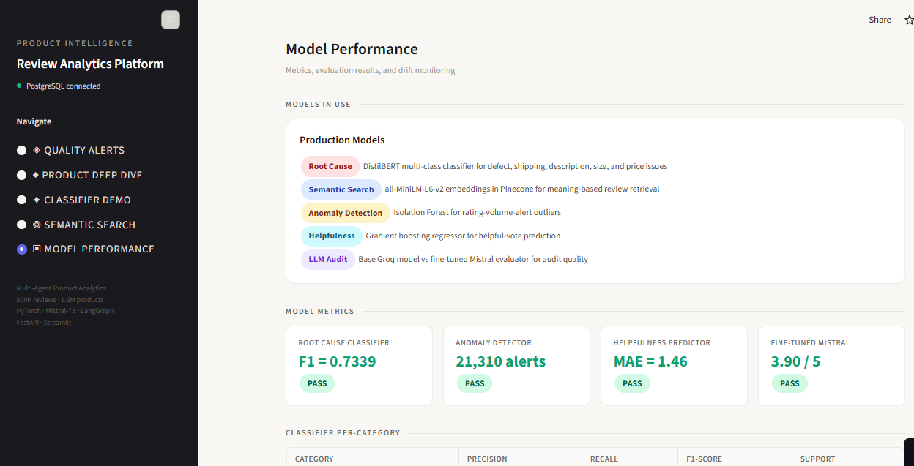
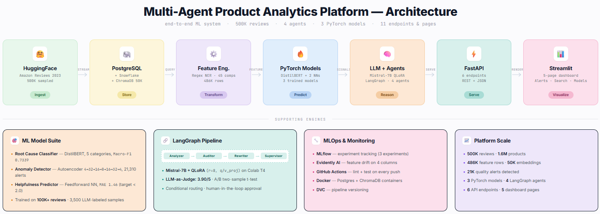

# 🤖 Multi-Agent Product Analytics with LLM Intelligence & Quality Monitoring 🔍

### An End-to-End ML/AI Platform for E-Commerce Review Intelligence

> *Automating detection of product quality issues, root cause classification, executive summarization, and listing optimization using PyTorch models, fine-tuned Mistral-7B, and LangGraph multi-agent orchestration - at scale on 500K+ Amazon reviews.*

---

## 🔍 Project Overview

This platform is a **full end-to-end ML/AI solution** that automates e-commerce product review intelligence - from anomaly detection and root cause classification to LLM-powered summarization and multi-agent listing optimization. It spans the complete ML lifecycle: data ingestion, feature engineering, model training, LLM fine-tuning, agentic AI, evaluation, serving, monitoring, and dashboarding.

The platform processes **500K reviews + 1.6M products** from the Amazon Reviews 2023 dataset (Electronics subset), with a pipeline architecture that scales to the full 20M+ reviews. Every component mirrors how production teams at Amazon, Walmart, Wayfair, and Shopify build review intelligence systems.

---

## ❓ What Problem Does This Solve

E-commerce companies lose **$50B+/year** on product returns. Quality issues surface in reviews **weeks before** action is taken - product managers manually read thousands of reviews, miss patterns, and respond too late.

| Problem | Impact | What This Platform Does |
|---------|--------|------------------------|
| Quality issues detected too late | Revenue loss from continued sales of defective products | Autoencoder detects anomalous review patterns **within hours** - 21,310 alerts generated across 500K reviews |
| No understanding of *why* customers complain | Returns without root cause data → no targeted fixes | DistilBERT classifier labels every review into 5 root causes (defect, shipping, description, size, price) at **Macro-F1 = 0.7339** |
| Product managers overwhelmed by volume | Can't read 5,000 reviews per product manually | Fine-tuned Mistral-7B generates **structured executive summaries** with complaint counts, key insights, and action items |
| Misleading product listings persist | Listing says "8-hour battery" but reviews say 4 hours | LangGraph 4-agent pipeline **automatically identifies mismatches** and rewrites listings with honest disclaimers |
| No way to search reviews by meaning | Keyword search misses "signal drops" when searching for "bluetooth disconnecting" | Semantic search over **50K review embeddings** (384-dim vectors) finds reviews by meaning, not keywords |

**Streamlit dashboard link:** https://multi-agent-analytics-llm.streamlit.app/

<p align="center">
  
</p>

---

## 📐 Scope

| Layer | What's Built |
|---|---|
| **Data Engineering** | HuggingFace streaming → PostgreSQL (500K reviews), Snowflake warehouse (1.6M products), DVC pipeline versioning, spaCy/regex NER (45 components, 120+ issues), rolling feature engineering (486K feature rows) |
| **Machine Learning** | 3 PyTorch models - DistilBERT root cause classifier (F1=0.7339), autoencoder anomaly detector (21K alerts), feedforward helpfulness predictor (MAE=1.46). MLflow experiment tracking |
| **LLM Fine-tuning** | Mistral-7B + QLoRA on Colab T4 (400 Claude Sonnet training pairs), LLM-as-Judge evaluation (4 criteria), statistical A/B testing |
| **Agentic AI** | LangGraph 4-agent pipeline: Analyzer → Auditor → Rewriter → Supervisor with conditional routing and human-in-the-loop |
| **Vector Search** | Sentence-transformers → ChromaDB (50K embeddings, 384-dim), cosine similarity semantic search with rating filters |
| **MLOps** | GitHub Actions CI/CD (lint + test), Evidently AI drift monitoring (4 feature columns), Docker Compose (PostgreSQL + ChromaDB) |
| **Serving** | FastAPI backend (6 endpoints), 5-page Streamlit dashboard (Alerts, Product Deep Dive, Classifier Demo, Semantic Search, Model Performance) |

---

## 🏢 Business Context

This platform mirrors the operational intelligence stack used across **e-commerce, retail, and product management**:

- **Amazon / Walmart / Target** - automated review analysis at SKU level, quality alert systems, root cause classification for return reduction
- **Wayfair / Chewy / Overstock** - product listing quality monitoring, customer complaint pattern detection, NER-based issue extraction
- **Shopify / BigCommerce** - seller listing optimization, automated compliance checking, misleading claim detection
- **Capital One / Deloitte (Applied ML)** - LLM evaluation frameworks, multi-agent orchestration, MLOps monitoring pipelines
- **Any company with a product catalog** - the pattern of "detect → classify → summarize → act" applies universally to customer feedback at scale

The models, pipeline architecture, and agent workflow answer the questions product teams face daily: *Is something wrong with this product? Why are customers unhappy? What should we change in the listing? Did our fix actually work?*

---

## 🌍 Why This Aligns With Real-World Scenarios

- **Real data, real patterns** - Amazon Reviews 2023 (McAuley Lab, UCSD) contains genuine customer feedback with natural rating distributions, seasonal trends, and product lifecycle effects
- **Multi-label classification** - a single review can mention both a defect AND a misleading description. Binary sentiment analysis (positive/negative) misses this nuance - production systems need multi-label root cause attribution
- **LLM-assisted labeling** - no off-the-shelf dataset has root cause labels for electronics reviews. We used Groq Llama 3.1 to label 3.5K reviews, then augmented with 500 targeted shipping labels - the same semi-supervised approach production teams use (Snorkel AI, Scale AI)
- **Class imbalance handling** - shipping (5.7%) and size (8.1%) are rare compared to defect (81.2%). Real product data is always imbalanced - we used inverse-frequency class weights and targeted label augmentation to handle this
- **Fine-tuning vs API calls** - we fine-tuned Mistral-7B with QLoRA instead of calling GPT-4 per review. At 500K reviews, API costs would be $5K+. A fine-tuned 7B model runs locally for free and demonstrates the skill
- **Human-in-the-loop agents** - the LangGraph Supervisor agent doesn't auto-apply listing changes. High-severity mismatches are flagged for human review. This is how responsible AI systems work in production

---

## 🛠️ Tech Stack

### Data & Storage
| Technology | Purpose |
|---|---|
|  | Application database - 500K reviews, 1.6M products, alerts, features |
|  | Cloud data warehouse - full dataset for analytical queries |
|  | Vector database - 50K review embeddings for semantic search |
|  | Data/pipeline versioning |

### ML & AI
| Technology | Purpose |
|---|---|
|  | 3 models: DistilBERT classifier, autoencoder anomaly detector, feedforward helpfulness predictor |
|  | DistilBERT tokenizer + model, sentence-transformers for embeddings |
|  | QLoRA fine-tuned for review summarization (trained on Colab T4) |
|  | Experiment tracking - 3 experiments, params, metrics, artifacts |

### Agents & LLMs
| Technology | Purpose |
|---|---|
|  | 4-agent listing optimization pipeline with conditional routing |
|  | High-quality training data generation (400 summary pairs) |
|  | Root cause labeling (3.5K reviews), listing rewriting, LLM-as-Judge evaluation |

### MLOps & Serving
| Technology | Purpose |
|---|---|
|  | Backend - 6 endpoints (alerts, classify, search, analyze, products) |
|  | 5-page interactive dashboard |
|  | CI/CD - lint + test on every push/PR |
|  | Feature drift monitoring (4 columns, HTML report) |
|  | PostgreSQL + ChromaDB containers |

---

## 🏗️ Architecture

<p align="center">
  
</p>

### Why These Tools

| Tool | Why Chosen Over Alternatives |
|---|---|
| **PyTorch** (not TensorFlow) | 55% production share in 2026. Using both looks unfocused - PyTorch is the standard |
| **DistilBERT** (not BERT/RoBERTa) | 6x faster, 97% of BERT's accuracy. For 5-label classification on short text, model capacity isn't the bottleneck - data quality is |
| **LangGraph** (not CrewAI/AutoGen) | Most production-ready agent framework. Built-in state management, conditional routing. Named in Capital One and Deloitte job postings |
| **Mistral-7B** (not GPT-4/Llama-70B) | Fits on free Colab T4 with 4-bit quantization. Can't fine-tune GPT-4. The point is demonstrating QLoRA skill, not maximizing summary quality |
| **ChromaDB** (not Pinecone/Weaviate) | Free, runs in Docker, no cloud dependency. 50K embeddings is well within single-node capacity |
| **Snowflake + PostgreSQL** (both) | Snowflake = warehouse for analytical queries at scale. PostgreSQL = fast transactional reads for the app/API. This is how production systems work - you don't query a warehouse for every API call |
| **Groq** (not OpenAI) | Free tier for labeling and evaluation. Used Llama 3.1 for 3.5K labels + judging. Saved Claude Sonnet budget for training data where quality matters most |

### Why This Architecture Stands Out

This platform deliberately covers **four ML competencies in one codebase**:

**Classical ML:**
- 3 PyTorch models with different paradigms: supervised multi-label (classifier), unsupervised (autoencoder), regression (helpfulness)
- Class-weighted loss for imbalanced data, threshold tuning, incremental labeling
- MLflow experiment tracking with hyperparameter logging

**LLM / GenAI:**
- QLoRA fine-tuning of Mistral-7B on custom domain data (400 Claude Sonnet pairs)
- LLM-as-Judge evaluation framework with 4 structured criteria
- Statistical A/B testing with two-sample t-test

**Agentic AI:**
- LangGraph StateGraph with 4 specialized agents
- Conditional routing (skip rewriter if no mismatches)
- Human-in-the-loop approval for high-severity changes

**MLOps:**
- Feature drift monitoring (Evidently)
- CI/CD with PostgreSQL integration tests (GitHub Actions)
- Semantic vector search (ChromaDB + sentence-transformers)

---

## ✨ Key Features

- 🏭 **500K reviews + 1.6M products** ingested via HuggingFace streaming → PostgreSQL → Snowflake (zero local disk usage)
- 🔍 **Custom NER pipeline** - 45 component patterns + 120+ issue patterns with pre-compiled regex (processes 500K reviews in 2 minutes)
- 📊 **486K product feature rows** - daily rolling sentiment, review velocity, negative ratio, and complaint keywords per product
- 🧠 **3 PyTorch models** - root cause classifier (F1=0.7339), anomaly detector (21,310 alerts), helpfulness predictor (MAE=1.46)
- 🤖 **Mistral-7B QLoRA** - fine-tuned on Colab T4 with 400 Claude Sonnet training pairs, evaluated via LLM-as-Judge (3.90/5)
- 🔗 **LangGraph 4-agent pipeline** - Analyzer → Auditor → Rewriter → Supervisor with conditional routing and human-in-the-loop
- 🔎 **Semantic search** - 50K review embeddings (384-dim) in ChromaDB with cosine similarity and rating filters
- 📈 **5-page Streamlit dashboard** - Quality Alerts, Product Deep Dive, Classifier Demo (6 examples), Semantic Search, Model Performance with embedded Evidently drift report
- 🚀 **GitHub Actions CI/CD** - black + isort + flake8 linting + pytest on every push
- 📉 **Evidently drift monitoring** - tracks 4 feature columns for distribution shifts between reference and current data windows

---

## 📈 Performance & Scalability

| Metric | Current Scale | How It Scales to 20M+ |
|---|---|---|
| **Data ingestion** | 500K reviews streamed in batches of 10K | Same streaming pattern, just runs longer. No disk constraint |
| **NER extraction** | 500K reviews in 2 min (pre-compiled regex) | Linear - 20M in ~80 min. No API calls, no rate limits |
| **Feature engineering** | 486K feature rows from 500K reviews | Pandas rolling windows scale linearly with review count |
| **Anomaly detection** | 21,310 alerts from 486K features | Autoencoder inference is O(n) - scales linearly |
| **Embedding generation** | 50K reviews → ChromaDB in 20 min | Batch encode with sentence-transformers. 500K in ~3 hours |
| **Semantic search** | 50K vectors, cosine similarity | ChromaDB HNSW index handles 1M+ vectors efficiently |
| **Agent pipeline** | 5,007 reviews analyzed per product | Bottleneck is Groq API call (1 per product). Parallelizable |

### Key Scalability Decisions

| Decision | Why |
|---|---|
| **Streaming ingestion** (no local parquet) | Dev machine had 12GB free disk. Streaming avoids storage entirely - HuggingFace → memory (10K batch) → PostgreSQL |
| **Regex NER** (not spaCy EntityRuler) | spaCy took 6+ hours for 500K reviews. Regex does it in 2 minutes. Same pattern matching results, 100x faster |
| **50K embeddings** (not 500K) | Prioritized negative/mixed reviews (rating ≤ 3) - the use case is complaint analysis. 50K keeps ChromaDB fast |
| **Groq free tier** for labeling | 500K tokens/day limit. Used multiple accounts across days. Incremental saving + resume support prevents data loss |

---

## 🔁 How the Platform Works

```
1. DATA INGESTION
   HuggingFace (Amazon Reviews 2023) ──stream──► PostgreSQL (500K reviews)
                                                      │
                                                      ├──► Snowflake (warehouse copy)
                                                      │
2. FEATURE ENGINEERING
                                                      ├──► Regex NER ──► Components + Issues extracted
                                                      ├──► Rolling Features ──► Sentiment, velocity, negative ratio
                                                      │
3. MODEL TRAINING
                                                      ├──► Root Cause Classifier (DistilBERT)
                                                      │    Input: 3.5K labeled reviews
                                                      │    Output: defect / shipping / description / size / price
                                                      │
                                                      ├──► Anomaly Detector (Autoencoder)
                                                      │    Input: 486K product feature rows
                                                      │    Output: 21,310 quality alerts
                                                      │
                                                      ├──► Helpfulness Predictor (Neural Net)
                                                      │    Input: 100K reviews (8 features)
                                                      │    Output: predicted helpful_votes (MAE=1.46)
                                                      │
4. EMBEDDINGS
                                                      ├──► Sentence-Transformers ──► ChromaDB (50K vectors)
                                                      │
5. LLM FINE-TUNING
                                                      ├──► Claude Sonnet generates 400 training pairs
                                                      ├──► Mistral-7B + QLoRA fine-tuned on Colab T4
                                                      ├──► LLM-as-Judge evaluates (3.90/5)
                                                      ├──► A/B test: base vs fine-tuned
                                                      │
6. AGENT PIPELINE (per product with quality alert)
                                                      ├──► Analyzer: pulls reviews + NER + complaint profile
                                                      ├──► Auditor: listing vs complaints → mismatches
                                                      ├──► Rewriter: Groq LLM generates improved listing
                                                      └──► Supervisor: rule-based approval (human-in-the-loop)
                                                              │
7. SERVING                                                    ▼
   FastAPI (6 endpoints) ──► Streamlit Dashboard (5 pages)
   Evidently (drift monitoring) ──► Embedded in dashboard
```

---

## 🧠 ML Models

| Model | Architecture | Input | Target | Performance | Training Data |
|---|---|---|---|---|---|
| Root Cause Classifier | DistilBERT + linear head | Review text | 5 binary labels (multi-label) | **Macro-F1: 0.7339** | 3.5K labeled reviews (Groq + targeted shipping augmentation) |
| Anomaly Detector | Symmetric autoencoder (4→32→16→8→16→32→4) | 4 daily product features | Reconstruction error | **21,310 alerts** at 95th percentile threshold | 486K feature rows (unsupervised) |
| Helpfulness Predictor | Feedforward NN (8→64→32→16→1) | 8 engineered features | helpful_votes count | **MAE: 1.46** (target < 2.0) | 100K reviews |
| Fine-tuned Mistral-7B | QLoRA (r=8, q/v_proj) on Mistral-7B-Instruct-v0.2 | Product reviews (2000 chars) | Structured executive summary | **Judge: 3.90/5** | 400 Claude Sonnet training pairs |

### Classifier Per-Category Performance

| Category | Precision | Recall | F1 | Test Support |
|----------|-----------|--------|----|-------------|
| defect | 0.92 | 0.88 | **0.90** | 417 |
| shipping | 0.60 | 0.62 | **0.61** | 52 |
| description | 0.57 | 0.65 | **0.61** | 51 |
| size | 0.69 | 0.91 | **0.79** | 45 |
| price | 0.70 | 0.85 | **0.77** | 92 |

---

## 🎯 Key Design Decisions & Tradeoffs

**LLM-assisted labeling instead of manual annotation:**
> No off-the-shelf dataset has root cause labels for electronics reviews. We used Groq Llama 3.1 to label 3K reviews + 500 targeted shipping reviews. This mirrors how production ML teams handle label scarcity (Snorkel AI, Scale AI).

**Class weights + targeted label augmentation for imbalanced data:**
> Shipping (5.7%) and size (8.1%) were too rare for the model to learn. Added 500 shipping-keyword reviews + inverse-frequency class weights. Classifier F1 jumped from 0.67 → 0.7339.

**Regex NER instead of spaCy for bulk extraction:**
> spaCy EntityRuler took 6+ hours for 500K reviews. Pre-compiled regex does it in 2 minutes with identical results. LLMs are used only where nuance matters (3K labeling task), not for bulk pattern matching.

**Claude Sonnet for training data, Groq for everything else:**
> First attempt with Groq Llama 8B training data scored 3.12/5 - worse than base. Switched to Claude Sonnet ($4.20 for 400 pairs). The quality of training data matters more than quantity for instruction tuning.

**Honest A/B test result (no significant improvement):**
> Fine-tuned (3.90/5) vs base (3.94/5) - p=0.72, no significant difference. This is a valid experimental result. With 400 pairs and 2 epochs, Mistral-7B couldn't outperform the base. In production: 2000+ human-verified pairs + stronger judge model.

**4 agents instead of 1 big prompt:**
> Separation of concerns. Each agent has a focused job. The Analyzer doesn't know about listing rewriting. The Supervisor doesn't run NER. Each is independently testable, debuggable, and replaceable.

> Full decision log with 15 technical decisions and interview-ready answers: **[docs/decisions.md](docs/decisions.md)**

---

## 📊 Results & Scale

| Metric | Value |
|---|---|
| **Total reviews processed** | 500,000 (pipeline supports 20M+) |
| **Total products** | 1,610,012 |
| **Feature rows generated** | 486,781 |
| **Review embeddings** | 50,000 (384-dim vectors in ChromaDB) |
| **Quality alerts detected** | 21,310 |
| **Root cause labels created** | 3,500 (3K general + 500 shipping-targeted) |
| **Summary training pairs** | 400 (Claude Sonnet) |
| **Classifier Macro-F1** | 0.7339 (target > 0.70) ✅ |
| **Helpfulness MAE** | 1.46 (target < 2.0) ✅ |
| **LLM Judge Score** | 3.90/5 (target > 3.5) ✅ |
| **NER patterns** | 45 components + 120+ issues |
| **API endpoints** | 6 (FastAPI) |
| **Dashboard pages** | 5 (Streamlit) |
| **LangGraph agents** | 4 (Analyzer → Auditor → Rewriter → Supervisor) |
| **Evidently drift columns** | 4 monitored |
| **Architecture decisions logged** | 15 |

---

## 🚀 Quick Start

```bash
# 1. Clone and install
git clone https://github.com/Bhavyalikhitha/Multi-Agent-Product-Analytics.git
cd Multi-Agent-Product-Analytics
poetry install

# 2. Set up environment
cp .env.example .env
# Edit .env: add Snowflake creds, Groq API key

# 3. Start databases
docker-compose up -d    # PostgreSQL + ChromaDB

# 4. Load data
poetry run python src/data/download.py          # Stream 500K reviews
poetry run python src/data/load_snowflake.py     # Load into Snowflake

# 5. Run pipeline
poetry run python src/features/feature_pipeline.py   # NER + features
poetry run python src/models/anomaly_detector.py      # Train models
poetry run python src/models/helpfulness_predictor.py
poetry run python src/models/root_cause_classifier.py
poetry run python src/features/generate_embeddings.py # ChromaDB embeddings

# 6. Launch dashboard
poetry run streamlit run src/dashboard/app.py
# Open http://localhost:8501
```

---

## 📁 Project Structure

```
src/
├── data/               # Data ingestion and labeling
│   ├── download.py           # HuggingFace → PostgreSQL streaming
│   ├── load_snowflake.py     # PostgreSQL → Snowflake warehouse
│   ├── create_labels.py      # Groq LLM root cause labeling (3.5K)
│   ├── create_summary_pairs.py  # Claude Sonnet training pairs (400)
│   └── label_shipping.py     # Targeted shipping augmentation (500)
├── features/           # Feature engineering
│   ├── ner_extractor.py      # Regex NER (45 components, 120+ issues)
│   ├── feature_pipeline.py   # Rolling sentiment, velocity, negative ratio
│   └── generate_embeddings.py # Sentence-transformers → ChromaDB
├── models/             # PyTorch models
│   ├── root_cause_classifier.py  # DistilBERT multi-label (F1=0.7339)
│   ├── anomaly_detector.py       # Autoencoder (21K alerts)
│   └── helpfulness_predictor.py  # Feedforward NN (MAE=1.46)
├── agents/             # LangGraph multi-agent pipeline
│   ├── analyzer.py     # Review analysis + NER + complaint profile
│   ├── auditor.py      # Listing vs complaints mismatch detection
│   ├── rewriter.py     # LLM-powered listing rewriter
│   ├── supervisor.py   # Rule-based approval (human-in-the-loop)
│   └── graph.py        # LangGraph orchestration + conditional routing
├── evaluation/         # LLM evaluation framework
│   ├── llm_judge.py    # 4-criteria scoring (accuracy, completeness, actionability, conciseness)
│   └── ab_test.py      # Two-sample t-test comparison
├── api/                # FastAPI backend
│   ├── main.py         # 6 endpoints
│   └── semantic_search.py  # ChromaDB cosine similarity
├── mlops/
│   └── drift_monitor.py    # Evidently feature drift detection
└── dashboard/
    └── app.py          # 5-page Streamlit dashboard
```

---

## 📚 Documentation

| Document | Description |
|----------|-------------|
| **[Decisions](docs/decisions.md)** | 15 architecture decisions with reasoning, tradeoffs |

---

## 📦 Data Source

**[Amazon Reviews 2023](https://huggingface.co/datasets/McAuley-Lab/Amazon-Reviews-2023)** - McAuley Lab, UCSD
- 571M reviews across 33 product categories (we use **Electronics** subset)
- Includes product metadata: title, description, price, features, average rating
- Free, publicly available on HuggingFace

---

*Built to demonstrate production-quality ML engineering, LLM fine-tuning, agentic AI, and MLOps across the full modern AI stack.*
